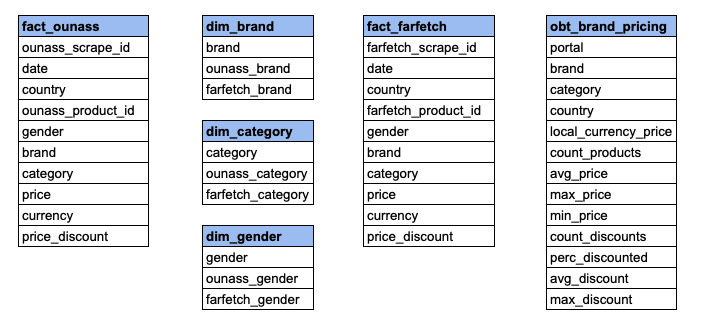

# E-commerce Scraper to OBT ETL Pipeline
 ## Project Summary
 The objective was to build an ETL pipeline that takes scraped product data from two e-commerce stores, Ounass and Farfetch, and creates tables that can be used to answer the following questions about the two stores:
- Which of the two stores has the best prices for each of the brands in Saudi Arabia, UAE, Qatar and Kuwait?
- Which of the two stores had more products on sale and deeper discounts on the top brands?
- What's the size of the catalogue for the two stores for the top brands when compared to each other?

The ETL process will take scraped JSON files from an S3 bucket, upload to Redshift for cleaning and transformation, and produce final tables that can be used for analysis. Scraper source can be found [here](https://github.com/tareklel/ecommercescraper). 

## Project steps:
- Scope and data gathering
- Data exploration and assessment
- Data model definition
- ETL process
----
## Scope and Data Gathering
### Scope
- Datasets
    - Product data was scraped from two luxury e-commerce platfirms: Ounass and Farfetch.
    - Data was scraped from the KSA, UAE, Kuwait and Qatar subfolders and subdomains.
    - Data scrapped included product name, URL, price, category, image URL and discounts
    - All data scraped is publically available. No private data was used.
    - Data from each domain scrape was then saved as json files in a S3 bucket under ounass.jl and farfetch.json
    - Data was scraped using a Scrapy [script](https://github.com/tareklel/ecommercescraper) built to scrape the two websites.
- Tools
   - AWS S3 for data storage
   - AWS Redshift for data warehousing and data analysis
   - Airflow to schedule and test pipeline
   - Docker for Airflow containerization
----
## Data Exploration and Assessment
Exploratory data analysis was undertaken using Jupyter Notebook and could be found in [eda](/eda) subfolder.
The following cleaning and transformations steps were undertaken:
1. Remove duplicate entries
2. Remove all non-product pages crawled
3. Convert prices to integers
4. Remove entries with null entries for essential fields
5. Remove unecessary category and gender dimensions
6. Transform category, gender, and brand dimensions so that they match between portals
---
## Data Model Definition
### Conceptial Data Model
The data models are split between: 
1. OLAP dim and fact tables related to product listing dimensions and prices
2. One big table comparing the performance of different brand categories between the two portals.

---
## ETL Process
### Airflow DAG
### Data Quality Check
Data quality check includes:
1. No empty tables after running
2. Check for duplicate entries
3. Check for null values in essential dimensions and facts
4. Ensure all prices are integers
5. Unecessary categories and brands are removed
---
## Project Details
### Data Update Frequency
### Design Considerations
### Future Improvements

