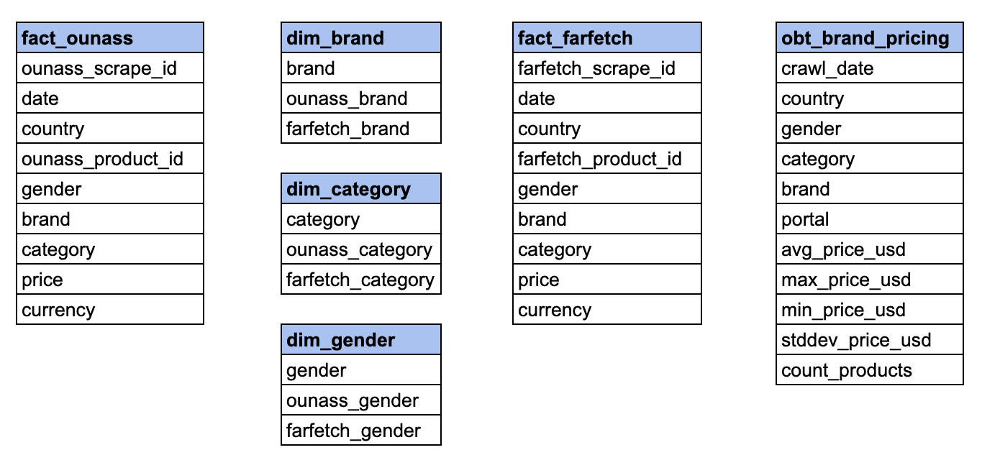

# E-commerce Scraper to OBT ETL Pipeline
 ## Project Summary
 The objective was to build an ETL pipeline that takes scraped product data from two separate e-commerce portals, Ounass and Farfetch, and creates tables that can be used to answer the following questions about the two portals:
- Which of the two portals has the best prices for each of the brands in Saudi Arabia, UAE, Qatar and Kuwait?
- What's the size of the catalogue for the two stores for the top brands when compared to each other?

The ETL process will take scraped JSON files from an S3 bucket, upload to Redshift for cleaning and transformation, and produce final tables that can be used for analysis. The scraper, which was built for this project, can be found [here](https://github.com/tareklel/ecommercescraper). 

Two datasets were created for this project one containing 129,683 Ounass records and the other 1,721,463 Farfetch records.

## Project steps:
- Scope and data gathering
- Data exploration and assessment
- Data model definition
- ETL process
----
## Scope and Data Gathering
### Scope
- Datasets
    - Product data was scraped from two luxury e-commerce platfirms: Ounass and Farfetch.
    - Data was scraped from the KSA, UAE, Kuwait and Qatar subfolders and subdomains.
    - Data scrapped included product name, URL, price, category, and image URL
    - All data scraped is publically available. No private data was used.
    - Data from each domain scrape was then saved as json files in a S3 bucket under ounass.jl and farfetch.json
    - Data was scraped using a Scrapy [script](https://github.com/tareklel/ecommercescraper) built to scrape the two websites.
    - Additional dictionary csv files were created for joining data
- Tools
   - AWS S3 for raw data storage
   - AWS Redshift for data warehousing and data analysis
   - Airflow to schedule and test data integrity
   - Docker for Airflow containerization
----
## Data Exploration and Assessment
Exploratory data analysis was undertaken using Jupyter Notebook and could be found in [eda](/eda) subfolder.
The following cleaning and transformations steps were undertaken:
1. Remove duplicate entries
2. Remove all non-product pages crawled
3. Convert prices to integers
4. Remove entries with null entries for essential fields
5. Remove unecessary category and gender dimensions
6. Transform category, gender, and brand dimensions so that they match between portals
---
## Data Model Definition
### Conceptial Data Model
The data models are split between: 
1. OLAP dim and fact tables related to product listing dimensions and prices
2. One big table comparing the performance of different brand categories between the two portals.

---
## ETL Process
### Airflow DAG
Airflow DAG for loading data from S3 bucket into staging

Airflow DAG for creating fact, dim and analytics tables

### Data Quality Check
Data quality check includes:
1. No empty fact tables after running
2. Check for null values in essential fact tables

### Data Dictionary

---
## Project Details
### Data Update Frequency
- Data is to be updated daily at 7AM in the morning with the latest crawl data. This way overtime daily pricing and SKU fluctuation across the portals can be monitored
- Fact and analytics tables should be updated by append so crawl_etl DAG should have truncate_table task removed for regular use.
### Design Considerations
- If data was increased by 100X, we can consider using AWS EMR (Elastic MapReduce) to run ETL. The distributed data cluster is a powerful tool for processing large datasets on the cloud.
- AWS RedShift can handle 500 connections at a time so it should easily handle an organization with 100+ users
### Future Improvements
- Gather discount data to understand fluctuations in discounts daily
- More granular understanding of pricing and SKU availability based on size

